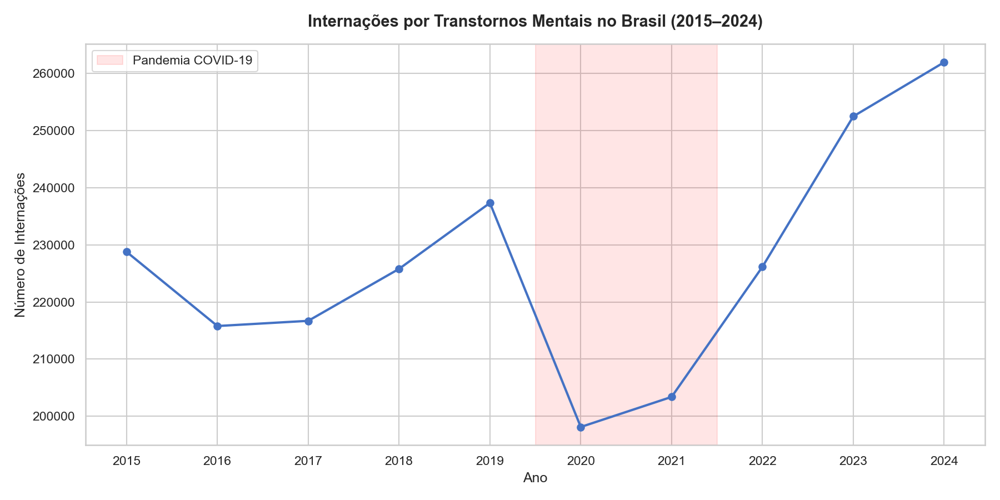
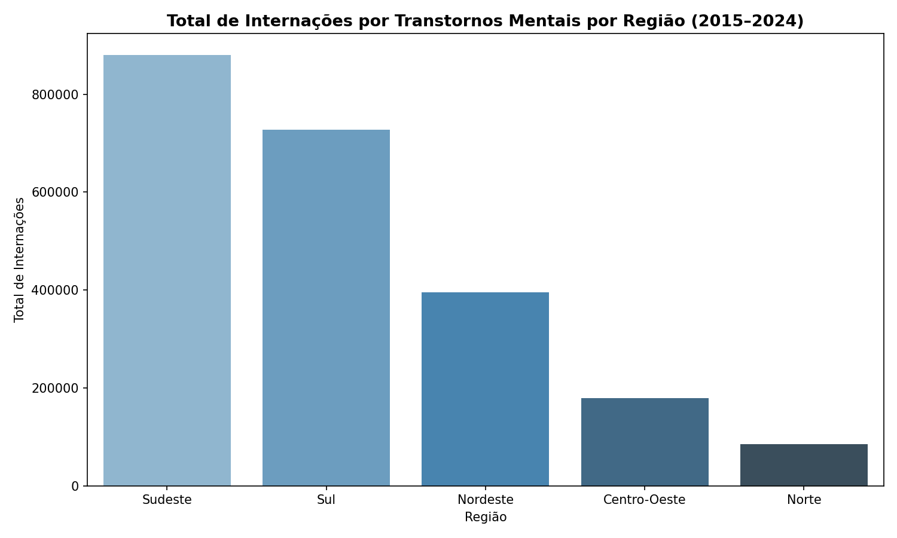
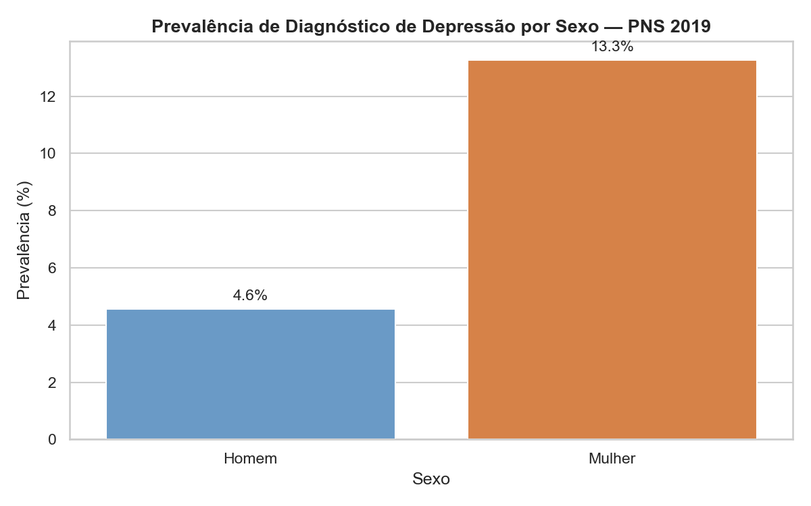
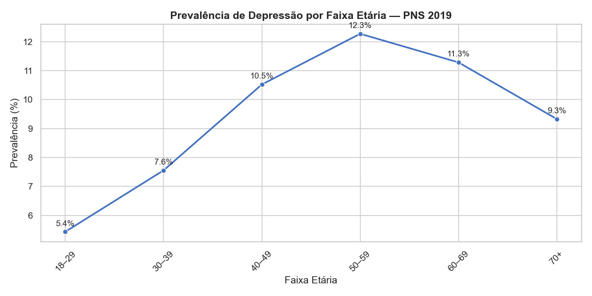
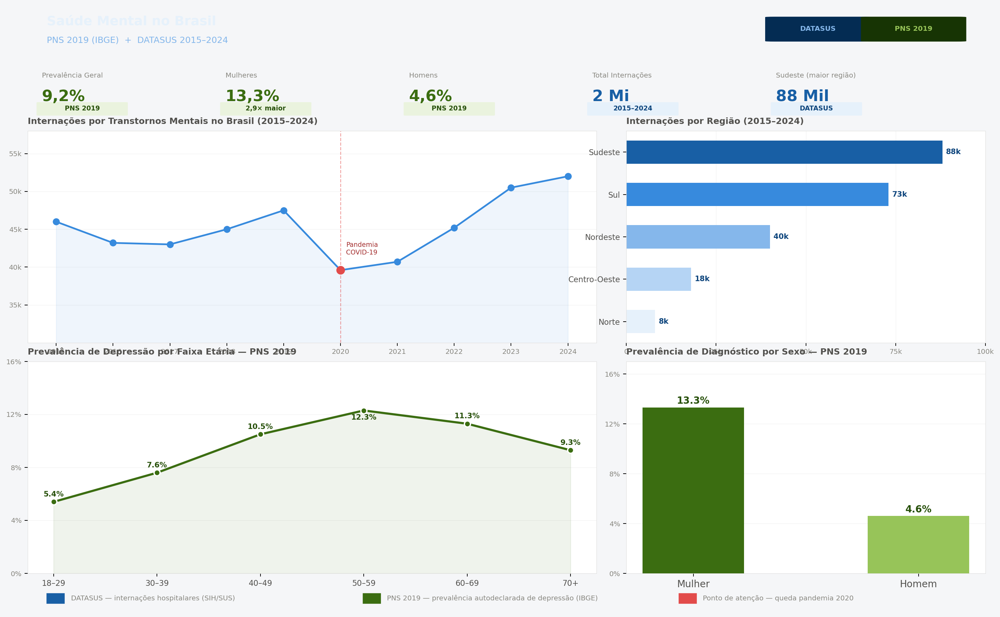

# Saúde Mental no Brasil: Uma Análise Exploratória

[](https://python.org)
[](https://pandas.pydata.org)
[](https://powerbi.microsoft.com)

---
Status do projeto

✅ Concluído
## Sobre o projeto

Análise exploratória do perfil epidemiológico dos transtornos mentais no Brasil,
combinando dados de prevalência (PNS 2019/IBGE) e internações hospitalares
(SIH/SUS DATASUS, 2015–2024).

## Pergunta de pesquisa

Como variáveis sociodemográficas (sexo, faixa etária, região) se associam
à prevalência de depressão e ao padrão de internações psiquiátricas no Brasil?

---

## Fontes de dados

| Fonte | Período | Acesso |
|---|---|---|
| PNS 2019 — IBGE | 2019 | [Link](https://www.ibge.gov.br/estatisticas/sociais/saude/9160-pesquisa-nacional-de-saude.html) |
| SIH/SUS — DATASUS | 2015–2024 | [Link](https://datasus.saude.gov.br/informacoes-de-saude-tabnet/) |

> Os dados brutos não estão incluídos neste repositório devido ao tamanho dos arquivos.
> Consulte os links acima e o notebook `01_coleta_dados.ipynb` para reproduzir a análise.

---

## Estrutura do projeto

```
saude-mental-brasil/
├── data/
│   ├── raw/                  ← arquivos originais (não versionados)
│   └── processed/            ← dados após limpeza
├── notebooks/
│   ├── 01_coleta_dados.ipynb
│   ├── 02_limpeza_tratamento.ipynb
│   ├── 03_analise_datasus.ipynb
│   └── 04_analise_pns.ipynb
├── outputs/
│   └── figures/              ← gráficos gerados
├── dashboard-saude-mental.pbix
├── requirements.txt
└── README.md
```

---

## Principais achados

1. A prevalência geral de diagnóstico de depressão no Brasil em 2019 foi de aproximadamente **9,2%**, segundo a PNS 2019 (IBGE).

2. Mulheres apresentam prevalência de **13,3%** — aproximadamente 3 vezes maior que a dos homens (4,6%), padrão consistente com a literatura epidemiológica em saúde mental.

3. A prevalência de depressão aumenta com a idade, atingindo o pico na faixa de **50–59 anos (12,3%)**, com leve redução nas faixas seguintes.

4. Observa-se um **declínio nas internações por transtornos mentais em 2020–2021**, possivelmente relacionado à pandemia de COVID-19, que pode ter impactado o acesso a serviços de saúde mental e a priorização de notificações hospitalares.

5. A **região Sudeste** concentra o maior volume de internações psiquiátricas no período (2015–2024), porém é a região com maior densidade populacional. Esse achado merece investigação adicional, considerando fatores como densidade populacional, cobertura de serviços especializados e subnotificação em outras regiões (ex: Norte, região com menor número registrado).

---

## Discussão e Limitações

### Desigualdade regional nas internações

A concentração de internações por transtornos mentais na região Sudeste deve ser interpretada com cautela. Regiões com maior cobertura de serviços especializados, como hospitais psiquiátricos e Centros de Atenção Psicossocial (CAPS), tendem a registrar mais internações, o que não implica necessariamente maior prevalência de transtornos mentais na população.
A menor notificação na região Norte pode refletir **subcobertura assistencial**, pessoas com transtornos mentais que não chegam a ser internadas por falta de acesso a serviços especializados, e não por ausência de adoecimento. Uma análise mais robusta exigiria o cálculo da taxa de internação por 100 mil habitantes, controlada pela oferta de leitos psiquiátricos e cobertura de CAPS por região, o que constitui uma agenda de investigação para versões futuras deste projeto.

---

### Limitação temporal dos dados de prevalência

Os dados de prevalência de depressão utilizados neste projeto são da PNS 2019. Edição mais recente disponível desta pesquisa para a população adulta brasileira. A PNS é realizada pelo IBGE em ciclos de aproximadamente 5 a 7 anos; a próxima edição está prevista para 2026. Portanto, os dados de prevalência **não capturam possíveis mudanças ocorridas entre 2020 e 2025**, incluindo os impactos da pandemia de COVID-19 na saúde mental da população (um período documentado internacionalmente como de aumento expressivo de transtornos ansiosos e depressivos).
Os dados de internações (DATASUS/SIH-SUS) cobrem o período de 2015 a 2024 e permitem uma análise temporal mais recente, sendo complementares à fotografia oferecida pela PNS 2019.

---

### Validade e escopo dos dados

Os achados deste projeto têm caráter **exploratório e descritivo**. Os dados da PNS 2019 representam um recorte temporal específico e não devem ser interpretados como estimativas atuais da prevalência de depressão no Brasil. Os dados de internações (DATASUS, 2015–2024) também possuem limitação intrínseca: registram apenas casos que resultaram em internação hospitalar, excluindo a parcela da população que recebe tratamento ambulatorial, que não busca tratamento ou que não tem acesso a serviços de saúde mental.
Dessa forma, os resultados apresentados devem ser lidos como uma aproximação do fenômeno; úteis para identificar padrões e levantar hipóteses, e não como estimativas definitivas de prevalência populacional atual.

---

## Referências Bibliográficas

BRASIL. Ministério da Saúde. **Sistema de Informações Hospitalares do SUS (SIH/SUS)**. Brasília: DATASUS, 2024. Disponível em: https://datasus.saude.gov.br/informacoes-de-saude-tabnet/. Acesso em: 28 jun. 2026.

IBGE – INSTITUTO BRASILEIRO DE GEOGRAFIA E ESTATÍSTICA. **Pesquisa nacional de saúde 2019**: percepção do estado de saúde, estilos de vida, doenças crônicas e saúde bucal: Brasil e grandes regiões. Rio de Janeiro: IBGE, 2020. (ISBN 978-65-87201-33-7). Disponível em: https://biblioteca.ibge.gov.br/visualizacao/livros/liv101764.pdf. Acesso em: 28 jun. 2026.

IBGE – INSTITUTO BRASILEIRO DE GEOGRAFIA E ESTATÍSTICA. **Pesquisa Nacional de Saúde 2019**: microdados. Rio de Janeiro: IBGE, 2020. Disponível em: https://ftp.ibge.gov.br/PNS/2019/. Acesso em: 28 jun. 2026.


---
## Notas Metodológicas

### Prevalência vs. Distribuição — gráficos de depressão por sexo

Dois tipos de cálculo foram utilizados na análise e é importante distingui-los:

**Prevalência por grupo (usado no Python):**
Calcula a proporção de pessoas com diagnóstico *dentro de cada grupo*.
Fórmula: `diagnosticados(grupo) / total(grupo)`
Exemplo: 13,3% das mulheres entrevistadas relataram diagnóstico de depressão.

**Distribuição do total (gerada automaticamente no Power BI):**
Calcula quanto cada grupo representa *do total de diagnosticados*.
Fórmula: `diagnosticados(grupo) / total de diagnosticados (ambos os sexos)`
Exemplo: mulheres representam 52,89% de todos os casos diagnosticados.

Ambos os cálculos são válidos, mas respondem perguntas diferentes.
Este projeto adota a **prevalência por grupo** como métrica principal,
por ser a medida padrão em estudos epidemiológicos de saúde mental.

---
## Nota sobre uso de IA

Este projeto utilizou Claude (Anthropic) como ferramenta de assistência no desenvolvimento do código estruturação da análise e revisão da documentação. Todas as fontes de dados e referências bibliográficas são verificáveis e estão listadas neste README.

## Visualizações

### Internações por Transtornos Mentais (2015–2024)


### Internações por Região (2015–2024)


### Prevalência de Depressão por Sexo — PNS 2019


### Prevalência de Depressão por Faixa Etária — PNS 2019


---
## Dashboard


---

## Como reproduzir

```bash
pip install -r requirements.txt
jupyter notebook
```

---

## Tecnologias

Python | pandas | matplotlib | seaborn | Power BI

---

## Autora

Desiree Daphine — [LinkedIn](https://www.linkedin.com/in/desiree-daphine/) | [Lattes](http://lattes.cnpq.br/2522194140416829)
